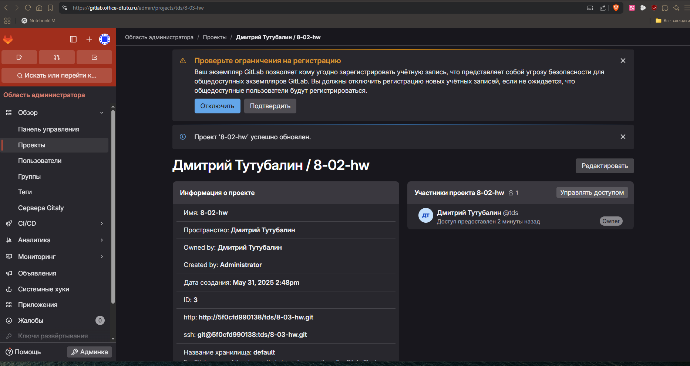
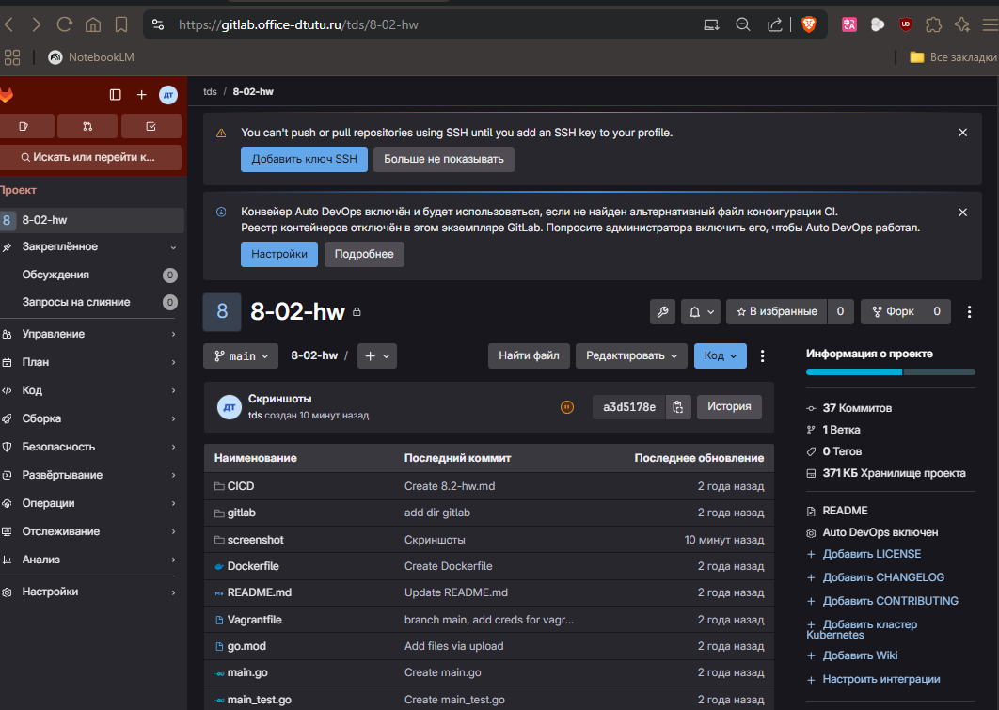
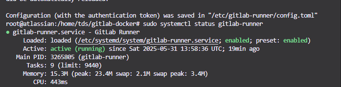
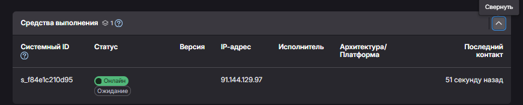

# Домашнее задание  - GitLab. Тутубалин Дмитрий

### Задание 1

**Что нужно сделать:**

1. Разверните GitLab локально, используя Vagrantfile и инструкцию, описанные в [этом репозитории](https://github.com/netology-code/sdvps-materials/tree/main/gitlab).   
2. Создайте новый проект и пустой репозиторий в нём.
3. Зарегистрируйте gitlab-runner для этого проекта и запустите его в режиме Docker. Раннер можно регистрировать и запускать на той же виртуальной машине, на которой запущен GitLab.

В качестве ответа в репозиторий шаблона с решением добавьте скриншоты с настройками раннера в проекте.

Ответ: 
Развернул GitLab, прикрутил также https, это уже для удобной работы. Штука интересная, буду юзать обязательно)
 

---

### Задание 2

**Что нужно сделать:**

1. Запушьте [репозиторий](https://github.com/netology-code/sdvps-materials/tree/main/gitlab) на GitLab, изменив origin. Это изучалось на занятии по Git.
2. Создайте .gitlab-ci.yml, описав в нём все необходимые, на ваш взгляд, этапы.

В качестве ответа в шаблон с решением добавьте: 
   
 * файл gitlab-ci.yml для своего проекта или вставьте код в соответствующее поле в шаблоне; 
 * скриншоты с успешно собранными сборками.
 
 Ответ: 
 Запушил репозиторий командой - git push -uf origin --all ;
 Предварительно изменил URL на свой - git remote set-url origin https://gitlab.office-dtutu.ru/tds/8-02-hw.git .
 

 Далее я установил gitlab-runner на хост, и зарегестрировал его командой: 
 sudo gitlab-runner register \
  --url "https://gitlab.office-dtutu.ru" \
  --registration-token "***" \
  --executor "docker" \
  --description "local-docker-runner" \
  --tag-list "docker,go" \
  --docker-image "docker:25.0.0" \
  --docker-volumes "/var/run/docker.sock:/var/run/docker.sock"
  
  

Создал файл .gitlab-ci.yml, с таким содержанием:
[image: golang:1.22-alpine            # базовый контейнер

stages:                              # порядок этапов
  - test
  - build

variables:                           # общие переменные
  CGO_ENABLED: "0"

before_script:                       # выполняется в каждом job
  - apk add --no-cache git
  - go version

unit_tests:
  stage: test
  script:
    - go test -v ./...               # запускаем все тесты
  artifacts:                         # сохраняем отчёт
    when: always
    reports:
      junit: report.xml
    paths:
      - report.xml
  tags: [docker, go]                 # привязываем к нашему раннеру

build_binary:
  stage: build
  needs: []                          # ← важный пункт для задания 3*
  script:
    - go build -o myapp .
  artifacts:
    paths:
      - myapp
  tags: [docker, go]
]
---
## Дополнительные задания* (со звёздочкой)

Их выполнение необязательное и не влияет на получение зачёта по домашнему заданию. Можете их решить, если хотите лучше разобраться в материале.

---

### Задание 3*

Измените CI так, чтобы:

 - этап сборки запускался сразу, не дожидаясь результатов тестов;
 - тесты запускались только при изменении файлов с расширением *.go.

В качестве ответа добавьте в шаблон с решением файл gitlab-ci.yml своего проекта или вставьте код в соответсвующее поле в шаблоне.